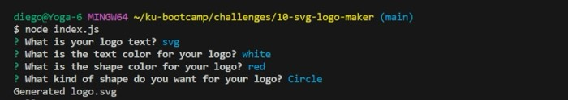

  # SVG Generator

  [](https://opensource.org/licenses/MIT)


## Table of Contents

  * [Description](#description)

  * [Installation](#installation)
  
  * [Usage](#usage)

  * [License](#license)

  * [Contributing](#contributing)

  * [Tests](#tests)

  * [Questions](#questions)

  ---

  ## Description
  This is a command line application that takes in user input to generate a logo and save it as an SVG file. The application prompts the user to select a color and shape, provide text for the logo, and save the generated SVG to a .svg file.

  ---  

  ## The application has to include the following acceptance criteria:

  ```md
    GIVEN a command-line application that accepts user input
    WHEN I am prompted for text
    THEN I can enter up to three characters
    WHEN I am prompted for the text color
    THEN I can enter a color keyword (OR a hexadecimal number)
    WHEN I am prompted for a shape
    THEN I am presented with a list of shapes to choose from: circle, triangle, and square
    WHEN I am prompted for the shape's color
    THEN I can enter a color keyword (OR a hexadecimal number)
    WHEN I have entered input for all the prompts
    THEN an SVG file is created named logo.svg
    AND the output text "Generated logo.svg" is printed in the command line
    WHEN I open the logo.svg file in a browser
    THEN I am shown a 300x200 pixel image that matches the criteria I entered
  ```
  ---
  ## Walkthrough of the Application

  [Video Walkthrough](https://drive.google.com/file/d/14QcVoHz3b1TPylpfb3iJ0jBmEwHgidGG/view)

Here is a screenshot of what the application looks like:



Example logo generated


  
  ---

  ## Installation

  To install necessary dependencies, run the following command:
  ```md
  npm i
  ```
  ---

  ## Usage
  Follow the install instructions and run node index.js to run the command line application

  ---

  ## License
  This project is licensed under the MIT license.

  ---

  ## Contributing
  To contribute to this application, create a pull request.

  ---

  ## Tests
  To run tests, run the following command:
  ```md
  npm test
  ```
  ---

  ## Questions
  If you have any questions about the repo, open an issue or contact me directly at diegoborjas@gmail.com. You can find more
  of my work at [diegoaborjas](https://github.com/diegoaborjas)

